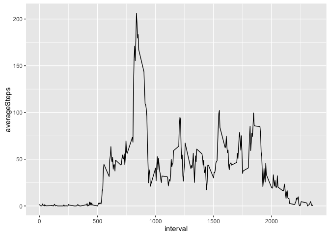
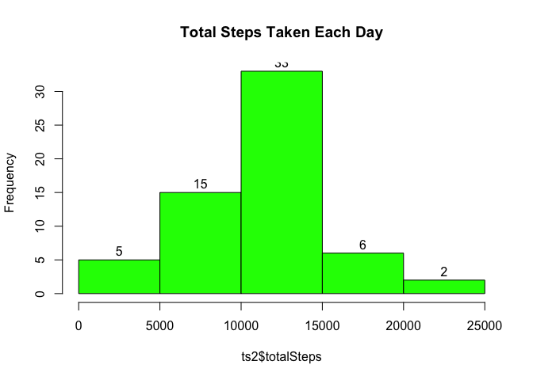
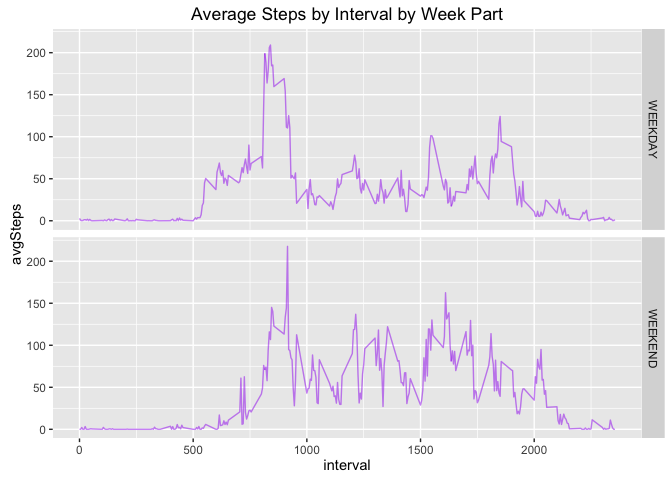

# Gyroscope Data
Neil Kutty  
July 16, 2016  

#### See rendered Rmd file at [Rpubs](http://rpubs.com/sampsonsimpson/represearch1)
**Loading and preprocessing the data**

Show any code that is needed to

Load the data (i.e. 𝚛𝚎𝚊𝚍.𝚌𝚜𝚟())
Process/transform the data (if necessary) into a format suitable for your analysis

*Answer:*

The first step is to `read.csv` the data into R and apply relevant transformations to create a usable `data frame`.

1. First load the libraries `Rmisc`,`dplyr`,`tidyr`,`chron`,`ggplot2`,and `mice`. (NOTE: package `Rmisc` uses `plyr` which needs to be loaded before `dplyr` for `dplyr::summarize` to work)
1. Next step, Read the data with `read.csv` into a `data frame` labeled `activity` using `colClasses` to specify the `date` variable's `class` as `date` by the user-defined `myDate` method. 


```r
setClass('myDate') 
setAs("character","myDate",
      function(from) as.Date(from, format="%Y-%m-%d"))

activity <- read.csv('activity.csv',
                     stringsAsFactors = FALSE,
                     colClasses = c('numeric','myDate','numeric'))
```
<br>
<hr>
<br>
**What is mean total number of steps taken per day?**

1. For this part of the assignment, you can ignore the missing values in the dataset.

1. Calculate the total number of steps taken per day
1. If you do not understand the difference between a histogram and a barplot, research the difference between them. Make a histogram of the total number of steps taken each day
1. Calculate and report the mean and median of the total number of steps taken per day

*Answer:*

##### Data with missing values


```r
#Get Timeseries data
ts <- activity %>%
    select(date,steps)%>%
    group_by(date)%>%
    summarize(avgSteps=mean(steps),
              totalSteps=sum(steps))

#Histogram 
hist(ts$totalSteps, main = "Total Steps Taken Each Day", col = "gray", labels = TRUE)
```

\

```r
#Mean and Median
summary(ts)
```

```
##       date               avgSteps         totalSteps   
##  Min.   :2012-10-01   Min.   : 0.1424   Min.   :   41  
##  1st Qu.:2012-10-16   1st Qu.:30.6979   1st Qu.: 8841  
##  Median :2012-10-31   Median :37.3785   Median :10765  
##  Mean   :2012-10-31   Mean   :37.3826   Mean   :10766  
##  3rd Qu.:2012-11-15   3rd Qu.:46.1597   3rd Qu.:13294  
##  Max.   :2012-11-30   Max.   :73.5903   Max.   :21194  
##                       NA's   :8         NA's   :8
```

From the above, we can see that the **mean steps per day is 10,766** and the **median steps per day is 10,765**.


<br>
<hr>
<br>
**What is the average daily activity pattern?**

1. Make a time series plot (i.e. 𝚝𝚢𝚙𝚎 = "𝚕") of the 5-minute interval (x-axis) and the average number of steps taken, averaged across all days (y-axis)
1. Which 5-minute interval, on average across all the days in the dataset, contains the maximum number of steps?

*Answer:*

##### Data with missing values


```r
omitData <- na.omit(activity)
ranked <- omitData %>%
    select(interval,steps) %>%
    group_by(interval) %>%
    summarize(averageSteps=mean(steps)) %>%
    arrange(desc(averageSteps))

ggplot(ranked, aes(x=interval,y=averageSteps)) + geom_line(stat="identity")
```

\

```r
topInt <- ranked[which.max(ranked$averageSteps),]

print(topInt)
```

```
## Source: local data frame [1 x 2]
## 
##   interval averageSteps
##      (dbl)        (dbl)
## 1      835     206.1698
```
    interval averageSteps<br>
    1      835     206.1698
<br>
<hr>
<br>
**Imputing missing values**

Note that there are a number of days/intervals where there are missing values (coded as 𝙽𝙰). The presence of missing days may introduce bias into some calculations or summaries of the data.

1. Calculate and report the total number of missing values in the dataset (i.e. the total number of rows with 𝙽𝙰s)
1. Devise a strategy for filling in all of the missing values in the dataset. The strategy does not need to be sophisticated. For example, you could use the mean/median for that day, or the mean for that 5-minute interval, etc.

1. Create a new dataset that is equal to the original dataset but with the missing data filled in.

###### *Answer:*

Sum missing values


```r
#Number of Missing Values
x <- sum(is.na(activity))
```
The number of missing values is 2304
The number of missing values is **2304**

Impute the missing values using the `mice` package. Ensure reproducibility by setting seed.  We create a `mids` object and then `complete()` it into a data frame.

```r
#Impute missing values
# -convert the activity$date column back to a 'character' class for imputation 
# -use mice::complete() to fill dataset using new imputed data
# -#convert the date variable back to a date class (mice needed a character class to impute)
activity$date <- as.character(activity$date)
imputedData <- mice(activity, m=5, maxit=50, meth= 'pmm', seed = 500)
newData <- complete(imputedData,2)
newData$date <- as.Date(newData$date)
```


1. Make a histogram of the total number of steps taken each day and Calculate and report the mean and median total number of steps taken per day. Do these values differ from the estimates from the first part of the assignment? What is the impact of imputing missing data on the estimates of the total daily number of steps?

*Answer:*

##### Data with missing values filled in.


```r
#Get Timeseries data
ts2 <- newData %>%
    select(date,steps)%>%
    group_by(date)%>%
    summarize(avgSteps=mean(steps),
              totalSteps=sum(steps))

#Histogram 
hist(ts2$totalSteps, main = "Total Steps Taken Each Day", col = "green", labels = TRUE)
```

\

```r
#Mean and Median
summary(ts2)
```

```
##       date               avgSteps         totalSteps   
##  Min.   :2012-10-01   Min.   : 0.1424   Min.   :   41  
##  1st Qu.:2012-10-16   1st Qu.:30.6979   1st Qu.: 8841  
##  Median :2012-10-31   Median :37.3785   Median :10765  
##  Mean   :2012-10-31   Mean   :37.1062   Mean   :10687  
##  3rd Qu.:2012-11-15   3rd Qu.:44.4826   3rd Qu.:12811  
##  Max.   :2012-11-30   Max.   :73.5903   Max.   :21194
```

From the above, we can see that the **mean steps per day is 10,687** and the **median steps per day is 10,765**.

*conclusion*: the imputed data impacted the **mean** of our dataset reducing it from 10,766 to 10,687.  The **median** remained the same at 10,765.

<br>
<hr>
<br>
**Are there differences in activity patterns between weekdays and weekends**

1. For this part the 𝚠𝚎𝚎𝚔𝚍𝚊𝚢𝚜() function may be of some help here. Use the dataset with the filled-in missing values for this part.

1. Create a new factor variable in the dataset with two levels – “weekday” and “weekend” indicating whether a given date is a weekday or weekend day.
Make a panel plot containing a time series plot (i.e. 𝚝𝚢𝚙𝚎 = "𝚕") of the 5-minute interval (x-axis) and the average number of steps taken, averaged across all weekday days or weekend days (y-axis). See the README file in the GitHub repository to see an example of what this plot should look like using simulated data.

*Answer:*

##### Data with missing values filled in.

- The next step is to create a `factor` variable to identify whether or not the date of a record corresponds to a *weekend* or *weekday*.  Using `chron` package function `is.weekend()` pass an anonymous function to `sapply` on the `date` column creating new variable `WeekPart` identifying the `date` as corresponding to either a `WEEKEND` or a `WEEKDAY`. This will be used for the plots in later questions.


```r
#create a weekday variable for analysis purposes if needed
#create a WeekPart variable by passing an anonymous function to identify
#     if it's a WEEKEND or WEEKDAY using the chron::is.weekend() fx
activity <- newData %>%
    mutate(dayofweek = as.character(weekdays(date))) %>%
    mutate(WeekPart = as.factor(sapply(date,function(x){if(is.weekend(x))
                                           {"WEEKEND"}else{"WEEKDAY"}})))

#Get Timeseries data
d <- activity %>%
    select(date,interval,WeekPart,steps)%>%
    group_by(interval,WeekPart)%>%
    summarize(avgSteps=mean(steps),
              totalSteps=sum(steps))

#plot timeseries

p <- ggplot(d,aes(x=interval,y=avgSteps))+
    geom_line(stat="identity",color="purple",alpha=0.5)+
    ggtitle(label = "Average Steps by Interval by Week Part")+
    facet_grid(WeekPart ~ .)

plot(p)    
```

\
